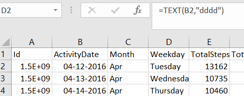
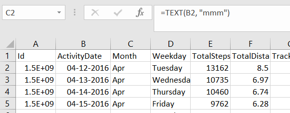
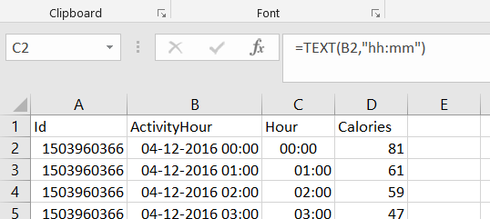

# **FitBit Smart Device Analysis**
**Amar Yedida** 
**30/01/2024** 
## Introduction 
Bellabeat is a high-tech company that manufactures health-focused smart products. Collecting data on activity, sleep, stress, and reproductive health has allowed Bellabeat to empower women with knowledge about their own health and habits.
## Businness Task  
Analyzing smart device usage data in order to gain insight into how people are already using their smart devices and identifying any trends in the data. Using this information to help guide Bellabeat marketing strategy. 
## About the Data
<a href="https://www.kaggle.com/datasets/arashnic/fitbit">FitBit Fitness Tracker Data</a>(CC0: Public Domain, dataset made available through <a href="https://www.kaggle.com/arashnic">Mobius)</a>: This Kaggle data set contains personal fitness tracker from thirty Fitbit users. Thirty eligible Fitbit users consented to the submission of personal tracker data, including minute-level output for physical activity, heart rate, and sleep monitoring. It includes information about daily activity, steps, and heart rate that can be used to explore users’ habits  
The dataset consists of 18 "CSV" files
## Data Preparation
Tools used: Microsoft Excel   
First I examined the data to find any null values through conditional formatting and also made the following observations through the advanced filter, and count function  
 Date range of data : 12/04/2016 to 12/05/2016   
No of Distinct users: 33 
No of Distinct users who recorded sleep: 24  
No of Distinct users who recorded weight: 8 
 
In the ["daily_activity"](cleaned%20data/daily_activity.csv) file, I created two columns to identify the "Month" and "Weekday" from "ActivityDate" column  
 
  
 
In the ["hourly_calories"](cleaned%20data/hourly_calories.csv), ["hourly_Intensities"](cleaned%20data/hourly_Intensities.csv), ["hourly_steps"](cleaned%20data/hourly_steps.csv) files, I created a column to identify the "Hour" from "ActivityHour" column 

