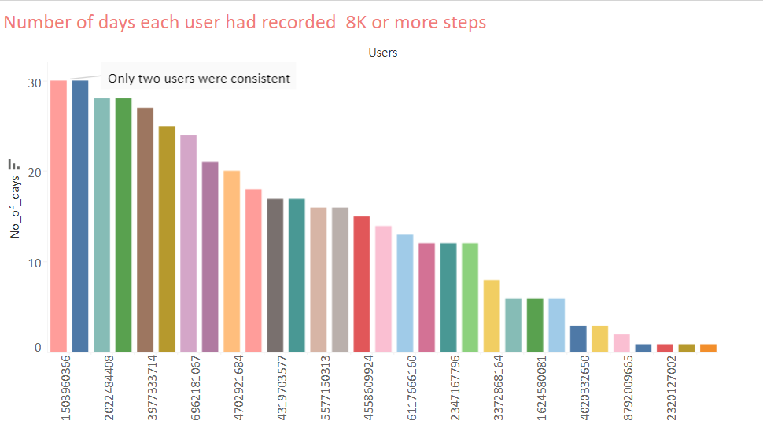
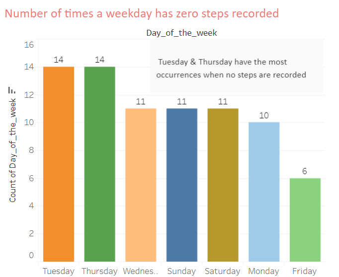

# **FitBit Smart Device Analysis**
**Amar Yedida** 
**30/01/2024** 
[Tableau Dashboard](https://public.tableau.com/views/Bellabeat_capstone_case_study/Dashboard1?:language=en-US&:display_count=n&:origin=viz_share_link)
## [**Introduction**](#introduction)  
## [**Business Task**](#business-task)  
## [**About the Data**](#about-the-data)  
## [**Data Preparation**](#data-preparation)  
## [**Analysis**](#analysis)  

## Introduction 
Bellabeat is a high-tech company that manufactures health-focused smart products. Collecting data on activity, sleep, stress, and reproductive health has allowed Bellabeat to empower women with knowledge about their own health and habits.
## Business Task 
Analyzing smart device usage data in order to gain insight into how people are already using their smart devices and identifying any trends in the data. Using this information to help guide Bellabeat marketing strategy. 
## About the Data
<a href="https://www.kaggle.com/datasets/arashnic/fitbit">FitBit Fitness Tracker Data</a>(CC0: Public Domain, dataset made available through <a href="https://www.kaggle.com/arashnic">Mobius)</a>: This Kaggle data set contains personal fitness tracker from thirty Fitbit users. Thirty eligible Fitbit users consented to the submission of personal tracker data, including minute-level output for physical activity, heart rate, and sleep monitoring. It includes information about daily activity, steps, and heart rate that can be used to explore users’ habits  
The dataset consists of 18 "CSV" files
## Data Preparation
Tools used: Microsoft Excel   
  First I examined the data to find any null values through conditional formatting and also made the following observations through the advanced filter, and count function  
 Date range of data : 12/04/2016 to 12/05/2016 (30 days)   
No of Distinct users: 33 
No of Distinct users who recorded sleep: 24  
No of Distinct users who recorded weight: 8 
 
In the ["daily_activity"](cleaned%20data/daily_activity.csv) file, I created two columns to identify the "Month" and "Weekday" from "ActivityDate" column  
 
  
 
In the ["hourly_calories"](cleaned%20data/hourly_calories.csv), ["hourly_Intensities"](cleaned%20data/hourly_Intensities.csv), ["hourly_steps"](cleaned%20data/hourly_steps.csv) files, I created a column to identify the "Hour" from "ActivityHour" column 
  

As the ["weightLogInfo.csv"](cleaned%20data/weightLogInfo.csv) has only data from 8 users it is not used in the analysis  
## Analysis
Tools used: Microsoft Excel, Tableau Public  

The total daily steps that users have recorded range from 0-36019. As per [CDC recommendation](https://www.cdc.gov/physicalactivity/basics/pa-health/index.htm) 8,000 to 10,000 steps per day is optimal for a healthy life. The following observations are made through visualizations in Tableau regarding daily steps   

  
  

  

  
  
    
   
   

     
As per [CDC recommendation](https://www.cdc.gov/physicalactivity/basics/adults/index.htm) 150 minutes of physical activity per week is optimal for a healthy life. Created a calcualted field in Tableau for total active minuted [(very active minutes)+(FairlyActive minutes)+(lightlyActive minutes) ].The following observations are made through visualizations in Tableau regarding active and sedentary minutes    
    
    
  
  
 
  

    
    
As per [CDC recommendation](https://www.cdc.gov/sleep/about_sleep/how_much_sleep.html) 7 or more hour of sleep is optimal for a healthy life.The following observations are made through visualizations in Tableau regarding the recorded sleep data      
  
  
  
Created a column in excel for sleep_time_diff [(TotalTimeInBed)-(TotalMinutesAsleep)].The following observations are made through visualizations in excel. 11 users have sleep_time_diff of 60 min above atleast once       
  
  

